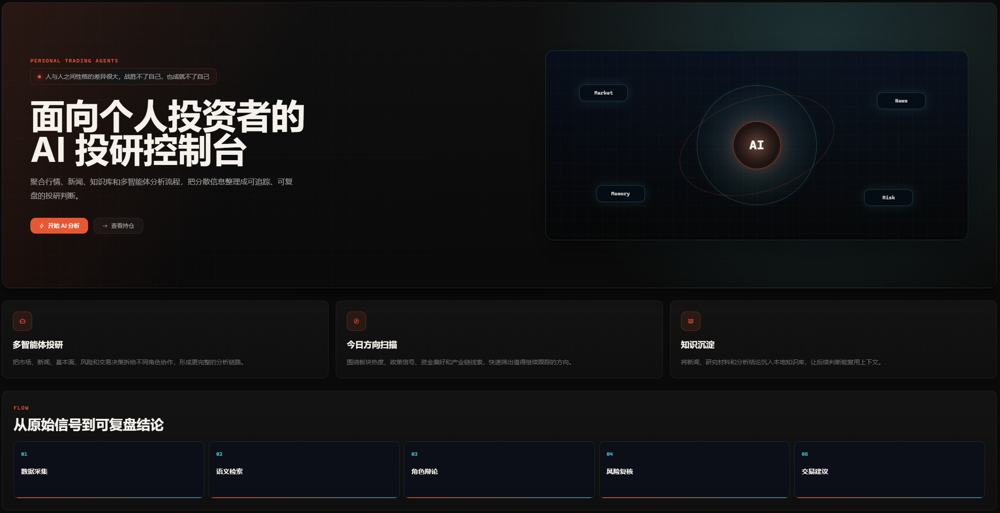
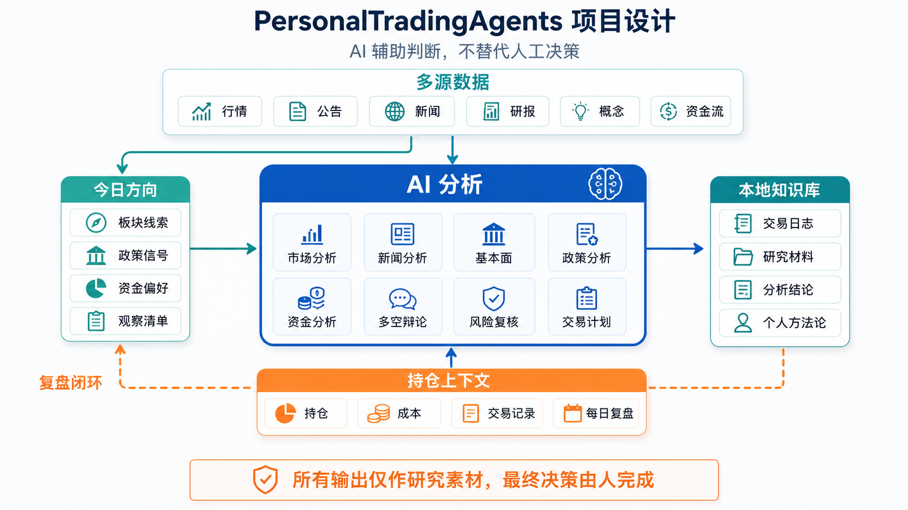
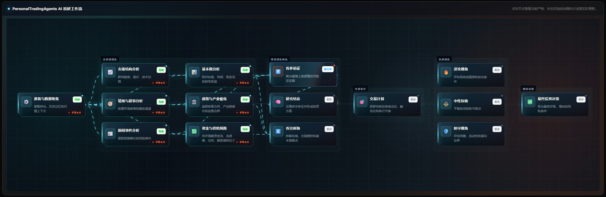

<h1 align="center">PersonalTradingAgents</h1>

<p align="center">
  面向 A 股个人投资者的本地 AI 投研工作台。
  <br />
  持仓驱动 · 多源数据 · 多 Agent 辩论 · 本地知识库 · 每日复盘
</p>

<p align="center">
  
  
  
  
</p>

<p align="center">
  <a href="#快速开始">快速开始</a>
  · <a href="#项目设计">项目设计</a>
  · <a href="#功能亮点">功能亮点</a>
  · <a href="#致谢">致谢</a>
  · <a href="#许可证">许可证</a>
  · <a href="#免责声明">免责声明</a>
</p>

> PersonalTradingAgents 不是自动交易机器人，也不是荐股工具。它用于个人研究、辅助决策和复盘，不构成任何投资建议。



## 为什么做这个项目

当前阶段的 AI 还不能在股市中完全替人判断方向，更不应该替人做最终交易决策。真正有价值的用法，是让 AI 帮我们整理信息、提出反方观点、识别风险、复核情绪化判断。

PersonalTradingAgents 的核心不是“让 AI 替你炒股”，而是帮助你把自己的所知所想记录下来，形成可复盘的知识库和方法论。

个人投研最难的也不是让 AI 回答一次“某只股票怎么看”，而是长期维护一套能够持续复盘的研究流程：

- 今天看过哪些材料，明天还能不能接上；
- 某只股票当初为什么买、为什么卖、当时的风险判断是什么；
- 行情、公告、新闻、研报、概念、资金流这些材料如何进入同一条分析链路；
- LLM 的结论能不能追溯到中间过程，而不是只剩一句“看多/看空”；
- 个人持仓、交易记录、研究结论和 API Key 能不能留在本地；
- 当自己情绪上头时，系统能不能用事实、风险和历史记录拉住自己。

PersonalTradingAgents 的目标，是把 TradingAgents 式多智能体投研范式落到个人 A 股工作流里，并且把“持仓、材料、分析、复盘、知识库”串起来。

## 项目设计



本项目的设计重点不是“更像券商研报”，而是“更适合个人长期使用”：

- **今日方向**：从板块线索、政策信号、资金偏好和观察清单中筛出值得继续跟踪的方向。
- **AI 分析**：这是系统的重中之重。Agent 负责拆解材料、补充视角、提出质疑、做风险复核和形成行动计划。
- **知识库**：把交易日志、研究材料、分析结论和个人方法论持续沉淀下来，为下一次判断提供上下文。

这三个模块形成闭环：今日方向提供输入，AI 分析形成阶段性判断，知识库记录过程和结果，再反过来影响下一次方向筛选。

### AI 分析流程



## 功能亮点

| 能力 | 说明 |
| --- | --- |
| A 股多源数据 | 东方财富、新浪、腾讯、同花顺、巨潮资讯、财联社、百度概念、雪球、Tushare、yfinance 等数据源或适配模块 |
| 多 Agent 投研 | 市场、新闻、情绪、基本面、政策、资金、研究辩论、风控、交易计划等角色分工 |
| 板块发现 | 政策、新闻、资金、市场宽度、行业/概念排序、验证、深挖与报告生成 |
| 组合管理 | 本地持仓、交易记录、交易费用、每日检查和组合状态 |
| 知识库 | raw 原始材料、wiki 可读页面、derived 派生索引 |
| Web 工作台 | React + FastAPI，覆盖个股、分析、组合、交易日志、知识库、板块、设置等页面 |
| 通知通道 | 企业微信、飞书、邮件通知配置，默认关闭 |

## 快速开始

### 环境要求

- Python 3.10+
- Node.js 18+
- Windows PowerShell、macOS 或 Linux shell

### 1. 安装后端依赖

```powershell
python -m pip install -e .
```

### 2. 安装前端依赖

```powershell
cd web
npm install
cd ..
```

### 3. 创建本地配置

Windows PowerShell：

```powershell
Copy-Item .env.example .env
```

macOS / Linux：

```bash
cp .env.example .env
```

编辑 `.env`，至少配置一个 LLM Provider：

```env
LLM_PROVIDER=openai
DEEP_THINK_MODEL=gpt-4o
QUICK_THINK_MODEL=gpt-4o-mini
OPENAI_API_KEY=your_api_key_here
```

也可以使用 DeepSeek、Anthropic、Google、Azure OpenAI、OpenRouter、Kimi、通义千问、智谱、MiniMax 等 provider。可用字段见 `.env.example`。

### 4. 启动

Windows PowerShell：

```powershell
.\start.ps1
```

macOS / Linux：

```bash
chmod +x ./start.sh
./start.sh
```

启动后访问：

- Web 工作台：http://localhost:5173
- API 文档：http://127.0.0.1:8000/docs
- 健康检查：http://127.0.0.1:8000/api/health

只启动后端：

```powershell
python main.py
```

## 常用页面

| 路径 | 用途 |
| --- | --- |
| `/` | 首页 |
| `/stock` | 个股详情 |
| `/analysis` | 分析任务 |
| `/portfolio` | 组合与持仓 |
| `/trades/daily` | 每日交易日志 |
| `/data/knowledge/raw` | 原始材料 |
| `/knowledge/manual` | 手动录入材料 |
| `/wiki` | 本地 Wiki |
| `/wiki/ingest` | Wiki 入库 |
| `/wiki/lint` | Wiki 检查 |
| `/sectors` | 板块发现 |
| `/settings` | 系统设置 |

## 知识库工作流

生成知识库文件后，你可以直接用 [Obsidian](https://obsidian.md) 打开 `data/knowledge` 文件夹进行浏览和编辑。知识库采用 Markdown 文件组织，兼容 Obsidian 的链接、标签和图谱视图。

此外，你也可以借助其他 AI Agent（如 Claude Code、Cursor 等）直接与本地 Wiki 进行交互，让 LLM 基于你的个人研究材料回答问题、补充分析或生成新的研究笔记。

## 本地数据与隐私

本项目默认把个人运行数据保存在 `data/` 目录，并通过 `.gitignore` 排除。请不要提交以下内容：

```text
.env
data/
web/knowledge/
*.db
*.sqlite
*.sqlite3
*.log
*.err.log
*.out.log
```

这些文件可能包含 API Key、持仓、交易记录、每日交易日志、LLM 输出、研究结论、本地 Wiki、缓存和通知 webhook。

公开仓库中建议只保留源码、文档、前端资源、`.env.example`，以及 `data/knowledge/schema/*.md` 这类不包含个人数据的规则文件。

## 致谢

本项目首先向 [TauricResearch/TradingAgents](https://github.com/TauricResearch/TradingAgents) 致敬。

TradingAgents 提出了用多智能体模拟投研机构协作的核心范式：分析师收集信息，研究员进行多空辩论，交易员形成计划，风控角色讨论风险，组合经理做最终决策。PersonalTradingAgents 的 Agent 思路深受 TradingAgents 启发，并在此基础上尝试面向 A 股个人投资者做本地化、持仓化和知识库化扩展。

本项目的知识库设计也受到 Andrej Karpathy 分享的 [Obsidian Wiki 工作流](https://x.com/karpathy/status/2039805659525644595) 启发——通过简单约定的文本笔记结构、派生索引和持续沉淀，把散落的信息整理成可检索、可追溯的个人知识系统。

如果这个项目对你有帮助，也请了解并支持 TradingAgents 原项目。

## 许可证

PersonalTradingAgents 是 [TauricResearch/TradingAgents](https://github.com/TauricResearch/TradingAgents) 的 fork 项目，延续原项目的 Apache License 2.0 授权方式发布。

在遵守 Apache 2.0 条款的前提下，你可以使用、修改和分发本项目代码。关于来源声明、版权保留和修改说明，请阅读 [LICENSE](LICENSE) 与 [NOTICE](NOTICE)。

## 免责声明

PersonalTradingAgents 仅用于个人研究、信息整理和交易复盘。

本项目不是自动交易系统，也不提供荐股、投顾、资产管理或任何形式的收益承诺。

系统产出的分析报告、交易信号、风险提示和复盘结论均由 AI 自动生成，可能存在错误、遗漏、延迟、偏差或不完整。

所有输出都应作为研究素材，而不是直接买卖依据。

请结合自身风险承受能力、资金情况、投资期限和交易规则独立判断；如需专业意见，请咨询具备相应资质的专业机构或从业人员。

作者和贡献者不对因使用、修改、部署、依赖或传播本工具及其输出内容而产生的任何投资损失承担责任。

股市有风险，投资需谨慎。
